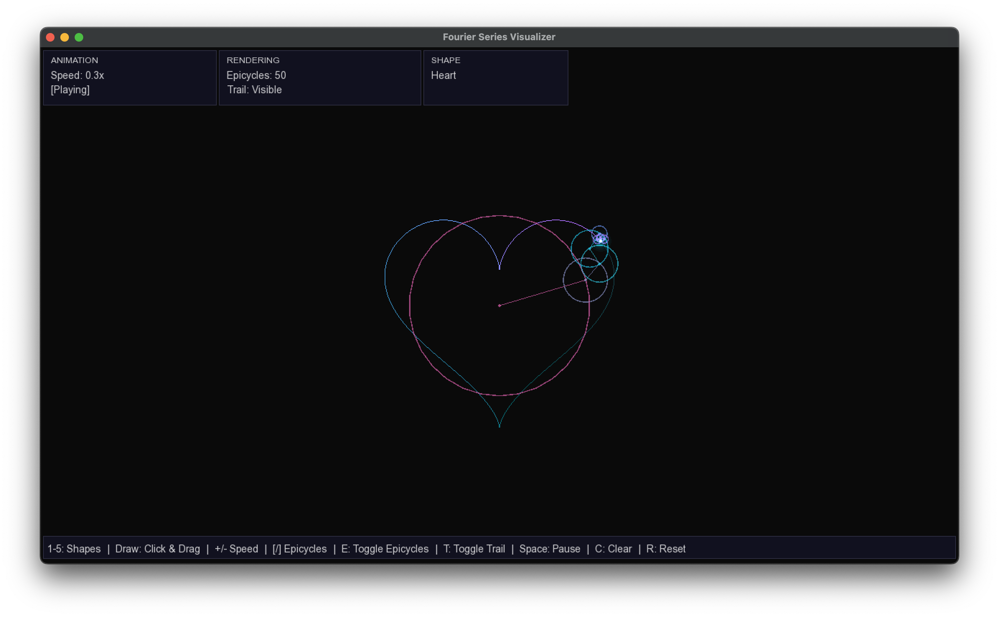
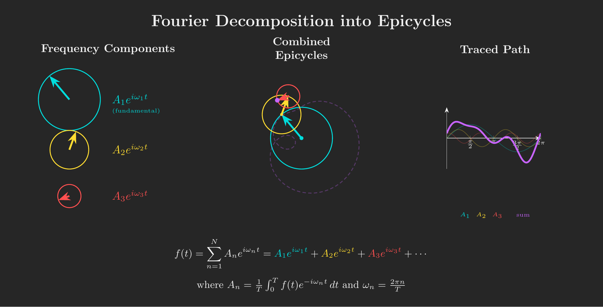

# Fourier Visualizer

A real-time visualizer that draws shapes using epicycles. It uses the Discrete Fourier Transform to decompose any shape into a series of rotating circles that trace out the original path.

## Epicycles

Epicycles are one of the most beautiful things math. The idea that you can take any squiggly drawing and break it down into spinning circles is mind-blowing. The Fourier transform is showing you the "DNA" of the shape, revealing all the hidden circular motions that combine to create what you drew. Plus, there's something weirdly hypnotic about watching the circles build up your shape point by point.



*The visualizer in action, showing epicycles tracing a shape*

## What it does

The program takes a 2D path and breaks it down into epicycles using DFT. Each epicycle is a circle rotating at a specific frequency, and when you chain them together, the endpoint traces out your original shape. It's basically showing you how any shape can be created by adding up a bunch of rotating circles, which is pretty cool to watch.

You can load preset shapes or draw your own with the mouse, and the program will compute the Fourier transform in real-time.

## How it works

The program samples points along your shape, then computes the DFT to find the frequency components. Each frequency becomes an epicycle with a specific radius, rotation speed, and starting angle. The epicycles are chained together, and the final point in the chain draws the trail that recreates your original shape.


*The mathematical principle behind epicycles: any path can be represented as a sum of rotating vectors.*
*(I made this using TikZ and LaTeX and I'm honestly pretty proud of it.)*


## Controls

**Shapes:**
- `1` - Circle
- `2` - Square
- `3` - Star
- `4` - Heart
- `5` - Infinity symbol
- Click & drag - Draw your own shape

**Animation:**
- `Space` - Pause/play
- `+` / `-` - Adjust speed
- `R` - Reset animation

**Rendering:**
- `[` / `]` - Decrease/increase number of epicycles
- `E` - Toggle epicycles visibility
- `T` - Toggle trail visibility

**Other:**
- `C` - Clear your drawing and reset to circle

## Building and Running

### Requirements
- CMake 3.10 or higher
- SFML 3.0
- C++17 compatible compiler

### Install SFML

On macOS with Homebrew:
```bash
brew install sfml
```

### Build
```bash
mkdir build
cd build
cmake ..
make
```

### Run
```bash
./fourier-visualizer
```
